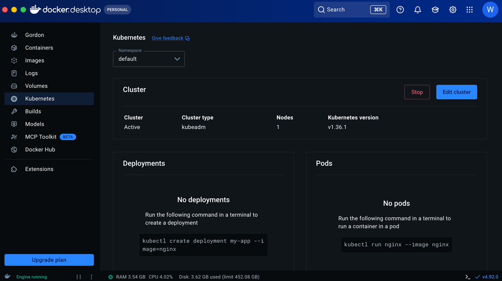

# p-14653-1-mission

1강 Docker Desktop에 Kubernetes 설치

 

2강 kubectl 기본 명령어

# 노드 목록 확인
kubectl get nodes

# 노드 상세 정보
kubectl describe node docker-desktop

# 네임스페이스 목록
kubectl get namespaces

# 또는 줄여서
kubectl get ns

# 특정 네임스페이스의 모든 리소스
kubectl get all -n kube-system

